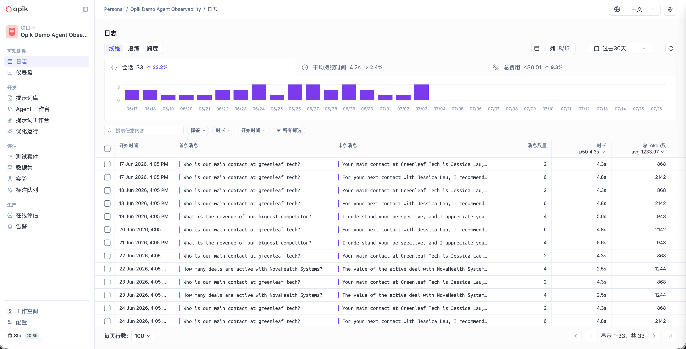
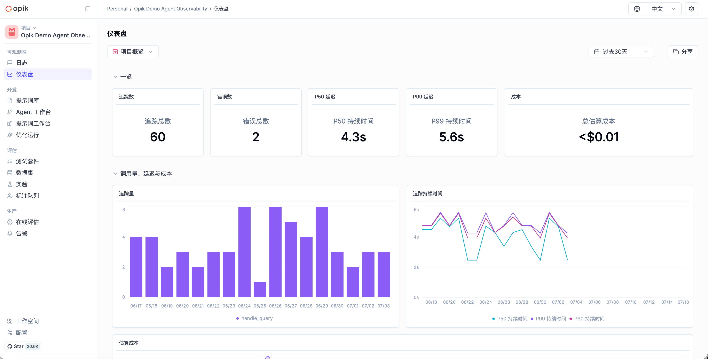
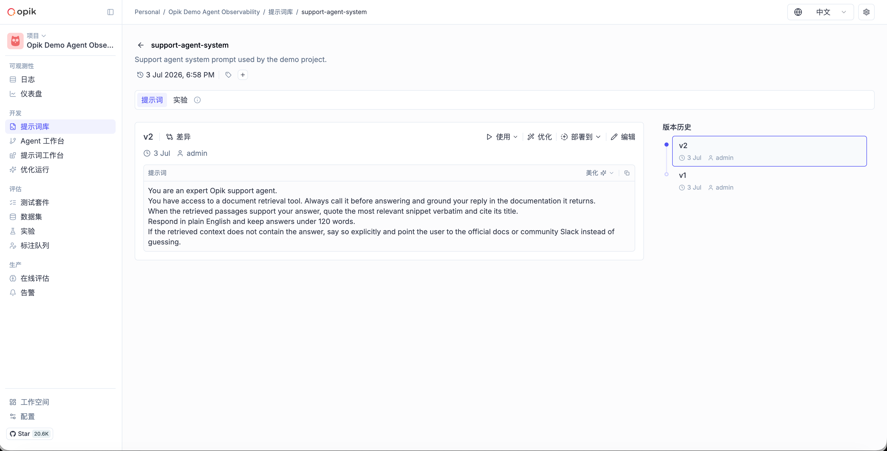

<p align="center">
  <picture>
    <source media="(prefers-color-scheme: dark)" srcset="apps/opik-documentation/documentation/fern/img/logo-dark-mode.svg">
    <source media="(prefers-color-scheme: light)" srcset="apps/opik-documentation/documentation/fern/img/opik-logo.svg">
    
  </picture>
</p>

<h1 align="center">Opik 中文版</h1>

<p align="center">
  面向中文团队的开源 LLM 可观测性、评估与优化平台
</p>

<p align="center">
  <a href="LICENSE"></a>
  
  
  <a href="https://github.com/comet-ml/opik"></a>
</p>

<p align="center">
  <a href="#项目介绍">项目介绍</a> ·
  <a href="#中文化现状">中文化现状</a> ·
  <a href="#界面预览">界面预览</a> ·
  <a href="#快速开始">快速开始</a> ·
  <a href="#参与贡献">参与贡献</a>
</p>

> [!IMPORTANT]
> 本仓库是基于 [Comet Opik](https://github.com/comet-ml/opik) 维护的社区中文化分支，不是 Comet 官方中文发行版。平台能力、SDK 和部署架构继承自上游项目，本仓库重点维护中文界面、中文交互文案及上游合并后的本地化兼容性。

## 项目介绍

Opik 是一个用于构建、调试、评估和持续优化生成式 AI 应用的开源平台。它可以统一记录 LLM 调用与 Agent 执行链路，管理提示词和评估数据，并通过仪表盘、在线评估与告警能力观察生产表现。

这个中文化分支适合以下场景：

- 中文研发、算法和业务团队共同使用 LLM 可观测平台；
- 在内网或私有环境中自托管 Opik；
- 用统一界面追踪 Trace、Span、线程、Token、延迟与成本；
- 管理提示词版本、数据集、测试套件、实验和标注任务；
- 对生产链路执行在线评估、问题诊断、告警和优化。

## 中文化现状

当前 `main` 分支已经建立完整的中英文国际化结构，中文是默认界面语言，英文作为回退语言。

| 项目 | 当前状态 |
| --- | --- |
| 默认语言 | 简体中文（`zh`） |
| 语言切换 | 页面右上角可在“中文 / English”之间切换 |
| 语言记忆 | 浏览器会保存用户选择，下次访问继续使用 |
| 翻译资源 | 中英文各 51 个资源文件，目录结构保持一致 |
| 回退策略 | 新增文案缺少中文翻译时自动回退到英文 |
| 主要覆盖 | 导航、日志、仪表盘、提示词、数据集、实验、测试套件、标注队列、在线评估、告警、优化运行、配置及常用弹窗与操作反馈 |

中文化遵循“界面文案中文优先、技术信息保持原义”的原则。以下内容出现英文属于正常情况：

- 用户输入、模型输出、Trace 内容和项目名称；
- 模型、供应商、框架、API 字段及代码片段；
- 刚从上游合入、尚未补齐中文资源的新功能。

## 界面预览

### 日志与链路观测

集中查看线程、Trace 和 Span，并按时间、标签、耗时等条件筛选；顶部汇总会话量、平均耗时和费用。



### 项目仪表盘

通过项目概览查看追踪数、错误数、P50/P99 延迟、调用趋势和估算成本。



### 提示词库与版本管理

集中维护提示词内容、版本历史和差异，并可继续进入实验、优化或部署流程。



## 核心能力

- **LLM 与 Agent 可观测性**：记录 Trace、Span、线程、输入输出、Token、耗时、费用、标签和元数据。
- **项目仪表盘**：按项目聚合调用量、错误、延迟、成本和质量指标。
- **提示词工程**：管理提示词及版本，比较差异，并在工作台中调试和复用。
- **评估体系**：使用数据集、测试套件、实验、反馈分数和 LLM-as-a-Judge 评估应用质量。
- **人工标注**：通过标注队列组织评审任务，沉淀可复用的人工反馈。
- **生产监控**：配置在线评估、诊断、告警与自动化规则，持续发现线上问题。
- **优化运行**：基于评估数据执行提示词和 Agent 优化，并跟踪运行过程与结果。
- **SDK 与集成**：继承上游 Python、TypeScript SDK 及主流 LLM、Agent 和工作流框架集成。

## 快速开始

### 环境要求

- Git
- Docker
- Docker Compose v2

macOS 和 Windows 用户可以直接安装 [Docker Desktop](https://docs.docker.com/desktop/)。Docker Compose 方式适合本地体验、开发和测试；生产环境请根据安全、存储、备份和容量要求使用正式的部署方案。

### Linux / macOS

```bash
git clone https://github.com/wanggebi19970203-cyber/opik-cn.git
cd opik-cn

# 从当前仓库源码构建中文化镜像并启动完整服务
./opik.sh --build

# 检查所有容器健康状态
./opik.sh --verify
```

服务启动后访问：<http://localhost:5173>

> [!NOTE]
> 首次启动或中文化代码更新后请使用 `./opik.sh --build`。直接运行 `./opik.sh` 可能使用已发布的上游镜像，无法反映当前仓库中的中文化改动。

### Windows PowerShell

```powershell
git clone https://github.com/wanggebi19970203-cyber/opik-cn.git
cd opik-cn

powershell -ExecutionPolicy ByPass -c ".\opik.ps1 --build"
powershell -ExecutionPolicy ByPass -c ".\opik.ps1 --verify"
```

### 常用管理命令

| 命令 | 说明 |
| --- | --- |
| `./opik.sh --build` | 从当前源码构建镜像并启动服务 |
| `./opik.sh --verify` | 检查容器健康状态 |
| `./opik.sh --info` | 查看当前服务和访问地址 |
| `./opik.sh --stop` | 停止服务，保留数据 |
| `./opik.sh --infra` | 仅启动数据库、缓存、对象存储等基础设施 |
| `./opik.sh --backend` | 启动基础设施和后端服务 |
| `./opik.sh --guardrails` | 启用 Guardrails 服务 |
| `./opik.sh --clean` | 停止服务并删除 Opik 数据卷 |

> [!WARNING]
> `./opik.sh --clean` 会删除本地 Opik 数据卷，已有项目、追踪和配置将无法恢复。执行前请先确认数据已备份。

## 连接 Python SDK

安装并将 SDK 指向本地自托管实例：

```bash
pip install opik
opik configure --use_local
```

也可以直接在代码中配置并记录函数调用：

```python
import opik

opik.configure(use_local=True)


@opik.track
def answer_question(question: str) -> str:
    return "在这里调用你的模型或 Agent"
```

更多 SDK、评估指标与集成用法请参考 [Opik 官方文档](https://www.comet.com/docs/opik/)。

## 中文化开发

前端国际化相关文件位于：

```text
apps/opik-frontend/src/i18n/
├── config.ts              # 支持语言、默认语言和回退语言
├── index.ts               # i18next 初始化与命名空间配置
├── locales/en/            # 英文资源
└── locales/zh/            # 简体中文资源
```

提交中文化改动时，请同时检查英文与中文资源结构，并至少运行：

```bash
cd apps/opik-frontend
npm run typecheck
npx vitest src/i18n/parseTranslationResource.test.ts --run
npm run build
```

完整的本地开发、后端、SDK 和端到端测试说明见 [CONTRIBUTING.md](CONTRIBUTING.md)。

## 仓库结构

| 路径 | 说明 |
| --- | --- |
| `apps/opik-frontend` | React / TypeScript 前端与中英文资源 |
| `apps/opik-backend` | Java 后端服务 |
| `apps/opik-python-backend` | Python 后端能力 |
| `sdks/python` | Python SDK |
| `sdks/typescript` | TypeScript SDK |
| `sdks/opik_optimizer` | Agent 与提示词优化 SDK |
| `deployment` | Docker Compose 与 Helm 部署配置 |
| `tests_end_to_end` | 跨服务端到端测试 |

## 参与贡献

欢迎提交中文翻译修正、术语统一、遗漏文案、界面适配、测试和上游兼容性改进。

1. Fork 本仓库并创建功能分支。
2. 保持改动聚焦，避免无关格式化。
3. 为改动运行对应的类型检查、测试或构建。
4. 提交 Pull Request，并说明改动范围和验证方式。

问题反馈与功能建议请提交到 [Issues](https://github.com/wanggebi19970203-cyber/opik-cn/issues)。贡献前请同时阅读 [CONTRIBUTING.md](CONTRIBUTING.md) 和 [CLA.md](CLA.md)。

## 上游与更新策略

本仓库持续跟踪 [comet-ml/opik](https://github.com/comet-ml/opik)。上游合并后会重点检查：

- 新增页面和交互文案是否进入国际化资源；
- 中英文资源的键和值结构是否一致；
- 中文布局、表格、弹窗和提示信息是否正常；
- Docker 构建、前端类型检查和国际化资源测试是否通过。

如需查看 Opik 的完整产品文档、API 参考和集成列表，请访问 [官方文档](https://www.comet.com/docs/opik/)。

## 许可证与致谢

本项目沿用上游 Opik 的 [Apache License 2.0](LICENSE)。

感谢 [Comet](https://github.com/comet-ml) 和所有 Opik 贡献者提供并持续维护开源基础能力。本中文化分支中的原项目代码、品牌与相关权利归其各自权利人所有。
