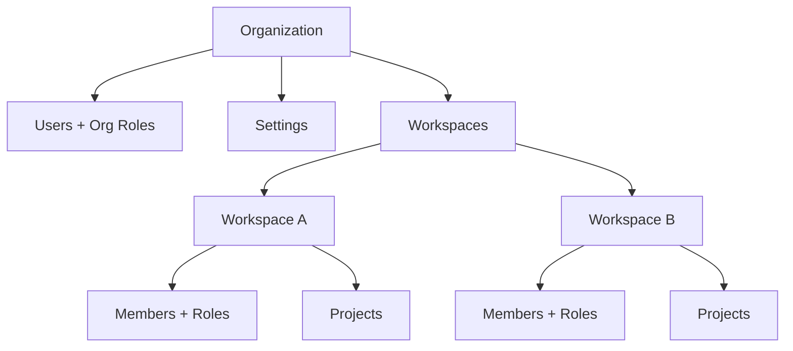

Opik Cloud 和企业版提供面向团队和组织的管理功能，包括：

- **基于角色的访问控制**：在组织和工作区级别分配细粒度权限
- **单点登录（SSO）**：通过 SAML 或 OIDC 与您的身份提供商进行用户认证
- **工作区隔离**：通过独立的访问控制将项目和数据按团队分隔
- **服务账户**：为 CI/CD 流水线和自动化工作流创建 API 密钥
- **用户管理**：通过中央仪表盘邀请团队成员、分配角色和管理访问权限
- **JWT 认证**：通过基于令牌的认证将 Opik 集成到现有系统中

<Note>
适用于 [Opik Cloud](https://www.comet.com/site/products/opik/) 和企业版。如需企业版定价，请[联系我们](https://www.comet.com/site/about-us/contact-us/)。
</Note>

## 快速开始

<CardGroup cols={2}>
  <Card title="管理仪表盘" href="/administration/admin-dashboard/overview">
    通过管理界面邀请用户、创建工作区和管理组织设置。
  </Card>
  <Card title="角色与权限" href="/administration/roles_and_permissions">
    了解组织角色和工作区角色如何控制用户的访问权限。
  </Card>
  <Card title="身份验证" href="/administration/authentication/overview">
    设置 SAML 或 OIDC 单点登录，或配置 JWT 以实现编程访问。
  </Card>
  <Card title="工作区设置" href="/administration/workspace-settings/overview">
    配置 AI 提供商、反馈定义及其他工作区级别的首选项。
  </Card>
</CardGroup>

## 核心概念

Opik 使用层级结构来组织用户和数据：

| 术语 | 描述 |
| --- | --- |
| **组织** | 您的公司或团队。包含所有用户、工作区和账单设置。 |
| **工作区** | 项目的容器。用户可以属于多个工作区，并在每个工作区中拥有不同的角色。 |
| **项目** | Trace 的容器。实验和数据集位于工作区级别。 |
| **组织角色** | 控制组织范围的权限（例如，管理员可以管理账单和用户）。 |
| **工作区角色** | 控制用户在特定工作区内的操作权限（例如，编辑者可以创建项目）。 |

以下是这些概念之间的关系：

<Tip>
建议为每个团队创建一个工作区。这有助于保持项目有序，并允许您根据团队成员的职责分配不同的角色。
</Tip>
