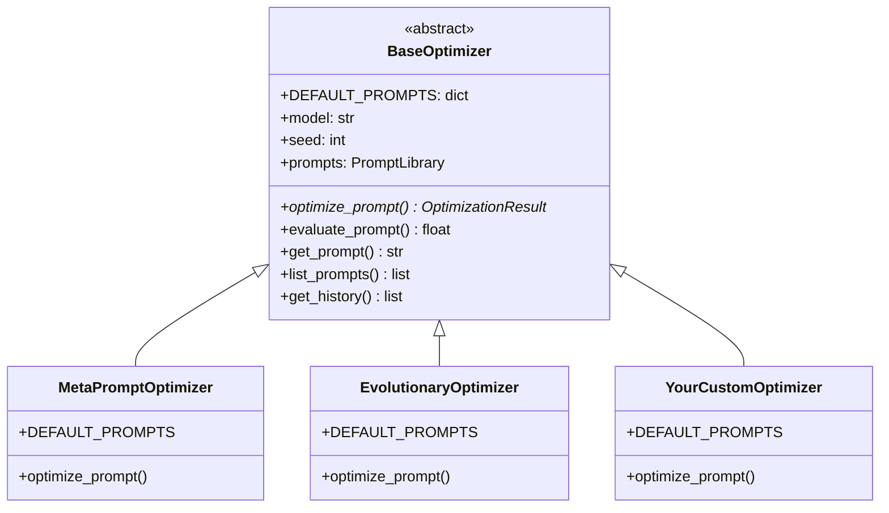

Opik Agent Optimizer 被设计为一个灵活的提示词和智能体优化框架。虽然它提供了一套强大的内置算法，但您可能有独特的优化策略或特殊需求。本指南展示如何通过扩展所有内置优化器使用的 `BaseOptimizer` 类来构建您自己的优化器。

## 架构概述

SDK 中的所有优化器都扩展了 `BaseOptimizer`，使您可以访问相同的基础设施：



## 自定义优化器的核心概念

要在 Opik 的生态系统中设计新的优化算法，您的优化器需要与几个关键组件交互：

1. **提示词（`ChatPrompt`）**：您的优化器接收一个 `ChatPrompt` 对象作为输入。聊天提示词是一个消息列表，每条消息包含角色、内容和可选的附加字段。这包括需要替换为实际值的变量。

2. **评估机制（指标和数据集）**：您的优化器需要一种方式来评分候选提示词。这通过创建一个 `metric`（接受 `dataset_item` 和 `llm_output` 作为参数并返回浮点数的函数）和一个评估 `dataset` 来实现。

3. **优化循环**：这是自定义优化器的核心。它包括：
   - **候选生成**：创建新提示词变体的逻辑。可以是基于规则的、LLM 驱动的或基于任何其他启发式方法。
   - **候选评估**：使用 `metric` 和 `dataset` 为每个候选者获取分数。
   - **选择/进阶**：决定保留哪些候选者、进一步优化哪些候选者，或如何根据分数调整生成策略的逻辑。
   - **终止条件**：何时停止优化的标准（例如，轮数、分数阈值、无改进）。

4. **返回结果（`OptimizationResult`）**：完成后，您的优化器返回一个 `OptimizationResult` 对象，标准化了结果报告的方式，包括找到的最佳提示词、其分数、优化过程的历史记录以及成本/使用指标。

## 创建自定义优化器

### 步骤 1：定义您的优化器类

扩展 `BaseOptimizer` 并定义您的 `DEFAULT_PROMPTS` - 您的算法使用的内部提示词：

```python
from opik_optimizer.base_optimizer import BaseOptimizer, OptimizationRound
from opik_optimizer.optimization_result import OptimizationResult
from opik_optimizer.api_objects.chat_prompt import ChatPrompt
from opik import Dataset
from typing import Any, Callable

class MyCustomOptimizer(BaseOptimizer):
    """
    A custom optimizer that implements [your algorithm description].
    """

    # Define internal prompts used by your algorithm.
    # Users can customize these via the prompt_overrides parameter.
    DEFAULT_PROMPTS = {
        "analysis_prompt": """Analyze the following prompt and identify improvement opportunities:

Current prompt:
{current_prompt}

Failure cases from evaluation:
{failures}

Identify specific issues and suggest concrete improvements.""",

        "generation_prompt": """Generate an improved version of this prompt:

Original prompt:
{current_prompt}

Focus areas for improvement:
{improvement_focus}

Return only the improved prompt text.""",
    }

    def __init__(
        self,
        model: str,
        max_iterations: int = 5,
        candidates_per_round: int = 3,
        improvement_threshold: float = 0.01,
        verbose: int = 1,
        seed: int = 42,
        **kwargs: Any,
    ) -> None:
        """
        Initialize the custom optimizer.

        Args:
            model: LiteLLM model name for the optimizer's internal LLM calls
            max_iterations: Maximum optimization rounds
            candidates_per_round: Number of candidate prompts to generate per round
            improvement_threshold: Minimum score improvement to continue
            verbose: Logging verbosity (0=off, 1=on)
            seed: Random seed for reproducibility
            **kwargs: Additional BaseOptimizer parameters (model_parameters, etc.)
        """
        super().__init__(model=model, verbose=verbose, seed=seed, **kwargs)
        self.max_iterations = max_iterations
        self.candidates_per_round = candidates_per_round
        self.improvement_threshold = improvement_threshold

    def get_optimizer_metadata(self) -> dict[str, Any]:
        """
        Expose optimizer-specific parameters for logging and tracking.
        This metadata appears in Opik experiment configurations.
        """
        return {
            "max_iterations": self.max_iterations,
            "candidates_per_round": self.candidates_per_round,
            "improvement_threshold": self.improvement_threshold,
        }
```

### 步骤 2：实现 optimize_prompt() 方法

这是实现您的优化逻辑的核心方法：

```python
def optimize_prompt(
    self,
    prompt: ChatPrompt,
    dataset: Dataset,
    metric: Callable,
    agent: Any = None,
    experiment_config: dict | None = None,
    n_samples: int | None = None,
    auto_continue: bool = False,
    project_name: str = "Optimization",
    optimization_id: str | None = None,
    validation_dataset: Dataset | None = None,
    max_trials: int = 10,
    **kwargs: Any,
) -> OptimizationResult:
    """
    Optimize a prompt using the custom algorithm.

    Args:
        prompt: The ChatPrompt to optimize
        dataset: Training dataset for feedback and context
        metric: Scoring function(dataset_item, llm_output) -> float
        agent: Optional custom agent for evaluation
        experiment_config: Optional experiment metadata
        n_samples: Limit dataset samples per evaluation (None = all)
        project_name: Opik project name for tracing
        validation_dataset: Optional separate dataset for candidate ranking
        max_trials: Maximum evaluation trials
        **kwargs: Algorithm-specific parameters

    Returns:
        OptimizationResult with best prompt, scores, and history
    """
    # 1. Initialize: Reset counters and set project context
    self._reset_counters()
    self.project_name = project_name

    # 2. Evaluate baseline prompt to establish starting point
    baseline_score = self.evaluate_prompt(
        prompt=prompt,
        dataset=dataset,
        metric=metric,
        n_samples=n_samples,
        verbose=self.verbose,
    )

    # 3. Check if baseline is already good enough (skip optimization)
    if self._should_skip_optimization(baseline_score):
        return self._build_early_result(
            optimizer_name=self.__class__.__name__,
            prompt=prompt,
            score=baseline_score,
            metric_name=metric.__name__,
            initial_prompt=prompt,
            details={"reason": "baseline_score_sufficient"},
        )

    # 4. Main optimization loop
    best_prompt = prompt
    best_score = baseline_score
    previous_best_score = baseline_score

    for iteration in range(self.max_iterations):
        # 4a. Generate candidate prompts based on current_best_prompt
        candidates = self._generate_candidates(
            current_prompt=best_prompt,
            dataset=dataset,
            metric=metric,
        )

        # 4b. Evaluate each candidate
        round_best_prompt = best_prompt
        round_best_score = best_score

        for candidate in candidates:
            # Use validation_dataset if provided, otherwise use training dataset
            eval_dataset = validation_dataset or dataset
            score = self.evaluate_prompt(
                prompt=candidate,
                dataset=eval_dataset,
                metric=metric,
                n_samples=n_samples,
                verbose=0,  # Reduce noise during candidate evaluation
            )

            # 4c. Select the best candidate from this round
            if score > round_best_score:
                round_best_score = score
                round_best_prompt = candidate

        # Update global best if this round improved
        if round_best_score > best_score:
            best_score = round_best_score
            best_prompt = round_best_prompt

        # 4d. Record optimization history
        self._add_to_history(OptimizationRound(
            round_number=iteration,
            current_prompt=best_prompt,
            current_score=best_score,
            generated_prompts=candidates,
            best_prompt=best_prompt,
            best_score=best_score,
            improvement=best_score - baseline_score,
        ))

        # 4e. Check termination conditions
        improvement = best_score - previous_best_score
        if improvement < self.improvement_threshold:
            if self.verbose:
                print(f"Converged at iteration {iteration}")
            break

        previous_best_score = best_score

    # 5. Prepare and return OptimizationResult
    return OptimizationResult(
        optimizer=self.__class__.__name__,
        prompt=best_prompt,
        score=best_score,
        metric_name=metric.__name__,
        initial_prompt=prompt,
        initial_score=baseline_score,
        details={
            "iterations_completed": iteration + 1,
            "total_candidates_evaluated": (iteration + 1) * self.candidates_per_round,
        },
        history=self.get_history(),
        llm_calls=self.llm_call_counter,
        llm_calls_tools=self.llm_calls_tools_counter,
        llm_cost_total=self.llm_cost_total,
        llm_token_usage_total=self.llm_token_usage_total,
    )
```

### 步骤 3：实现候选生成

您的自定义逻辑用于创建新的提示词变体。使用 `get_prompt()` 访问内部提示词（尊重用户的 `prompt_overrides`）：

```python
from opik_optimizer._llm_calls import call_model

def _generate_candidates(
    self,
    current_prompt: ChatPrompt,
    dataset: Dataset,
    metric: Callable,
) -> list[ChatPrompt]:
    """
    Generate candidate prompts using LLM-based improvement.

    Args:
        current_prompt: The prompt to improve
        dataset: Dataset for context (can analyze failures)
        metric: Metric for understanding what "good" means

    Returns:
        List of candidate ChatPrompt objects
    """
    candidates = []

    for i in range(self.candidates_per_round):
        # Get the generation prompt template (respects prompt_overrides)
        generation_request = self.get_prompt(
            "generation_prompt",
            current_prompt=current_prompt.get_messages(),
            improvement_focus=f"variation {i+1}: explore different approaches",
        )

        # Call LLM to generate an improved prompt
        response = call_model(
            messages=[{"role": "user", "content": generation_request}],
            model=self.model,
            seed=self.seed + i,  # Vary seed for diversity
            model_parameters=self.model_parameters,
            project_name=self.project_name,
        )

        # Parse the response and create a new ChatPrompt
        new_prompt = self._parse_prompt_from_response(response, current_prompt)
        if new_prompt is not None:
            candidates.append(new_prompt)

    return candidates

def _parse_prompt_from_response(
    self,
    response: str,
    template_prompt: ChatPrompt,
) -> ChatPrompt | None:
    """
    Parse LLM response into a new ChatPrompt.
    """
    try:
        new_prompt = template_prompt.model_copy(deep=True)
        # Update the system message with the improved prompt
        for msg in new_prompt.messages:
            if msg.get("role") == "system":
                msg["content"] = response.strip()
                break
        return new_prompt
    except Exception:
        return None
```

## BaseOptimizer 提供的功能

<Info>
  `BaseOptimizer` 类提供了所有现有优化器都利用的强大提示词评估机制。您的自定义优化器重用这些内部评估工具，以确保与 Opik 生态系统的一致性。
</Info>

| 组件 | 描述 |
|------|------|
| `evaluate_prompt()` | 使用指标对数据集评估提示词。处理线程、采样和结果聚合。 |
| `get_prompt(key, **fmt)` | 获取可选格式化的内部提示词模板。尊重 `prompt_overrides`。 |
| `list_prompts()` | 列出此优化器所有可用的提示词键。 |
| `_reset_counters()` | 重置 LLM 调用/成本计数器。在 `optimize_prompt()` 开始时调用。 |
| `_add_to_history()` | 跟踪优化轮次以供结果报告。 |
| `_should_skip_optimization()` | 检查基线分数是否超过 `perfect_score` 阈值。 |
| `_build_early_result()` | 在跳过优化时创建 `OptimizationResult`。 |
| `llm_call_counter` | 跟踪 LLM 调用次数。 |
| `llm_cost_total` | 跟踪总 API 成本（当提供商提供时）。 |
| `llm_token_usage_total` | 跟踪所有调用的令牌使用量。 |

## 使用结构化输出

对于复杂的生成，使用 Pydantic 模型获取结构化的 LLM 响应：

```python
from opik_optimizer._llm_calls import call_model
from pydantic import BaseModel

class PromptAnalysis(BaseModel):
    issues: list[str]
    suggestions: list[str]
    priority: str

# Returns a parsed Pydantic object, not raw text
analysis = call_model(
    messages=[{"role": "user", "content": "Analyze this prompt: ..."}],
    model=self.model,
    response_model=PromptAnalysis,
    project_name=self.project_name,
)

print(analysis.issues)      # ['Issue 1', 'Issue 2']
print(analysis.suggestions) # ['Suggestion 1', ...]
```

## 如何贡献

Opik 在不断发展，社区贡献非常有价值！

- **功能请求和想法**：如果您对新的优化算法、功能或对现有功能的改进有想法，请通过我们的社区渠道或在我们的 [GitHub 仓库](https://github.com/comet-ml/opik) 提交问题来分享。
- **错误报告**：如果您遇到问题或意外行为，详细的错误报告将非常感谢。
- **使用案例和反馈**：分享您的使用案例以及 Opik Agent Optimizer 如何满足（或未满足）您的需求，有助于我们优先安排开发工作。
- **代码贡献**：欢迎提交新优化器的拉取请求！请参阅[贡献指南](/contributing/guides/agent-optimizer-sdk)获取详细说明。

## 关键要点

- 扩展 `BaseOptimizer` 以创建具有完整 Opik 基础设施访问权限的自定义优化算法
- 为您的算法内部提示词定义 `DEFAULT_PROMPTS` - 用户可以通过 `prompt_overrides` 自定义这些提示词
- 使用继承的 `evaluate_prompt()` 评分候选者，实现您的优化逻辑的 `optimize_prompt()`
- 返回标准化的 `OptimizationResult` 对象以实现一致的报告和仪表板集成
- 使用 `_llm_calls.call_model()` 进行 LLM 交互，并自动跟踪成本/使用量

我们鼓励您探索现有的[优化器算法](/development/optimization-runs/algorithms/overview)以了解这些挑战的不同解决方案。

## 相关内容

- [自定义优化器提示词](/development/optimization-runs/advanced/prompt_customization) - 自定义内部提示词
- [自定义指标](/development/optimization-runs/advanced/custom_metrics) - 构建评估指标
- [API 参考](/development/optimization-runs/advanced/api_reference) - 完整参数文档
