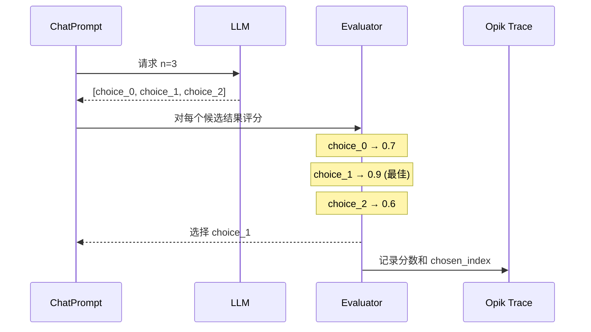

在优化提示词时，单样本评估可能存在噪声——由于大语言模型的随机性，一个好的提示词在某次特定试验中可能会失败。`n` 参数允许您为每次评估生成**多个候选输出**并选择最佳结果，从而引入多样性并降低评估方差。

<Info>
  适用于 Opik Optimizer `v3.0.0+` 版本。
</Info>

## 工作原理

当您在提示词的 `model_parameters` 中设置 `n > 1` 时，优化器会为每次评估请求 N 个补全，对每个候选结果进行评分，选择最佳结果，并将所有分数记录到追踪中。关于 `n` 参数工作原理的完整说明请参阅[采样控制](/development/optimization-runs/advanced/n_samples#multiple-completions-per-example-n-parameter)。



## 配置

在 `ChatPrompt.model_parameters` 中设置 `n` 参数：

```python
from opik_optimizer import ChatPrompt

# 每次评估生成 3 个候选结果，选择最佳
prompt = ChatPrompt(
    model="gpt-4o-mini",
    messages=[
        {"role": "system", "content": "You are a helpful assistant."},
        {"role": "user", "content": "Answer: {question}"},
    ],
    model_parameters={
        "n": 3,  # 每次调用生成 3 个补全
        "temperature": 0.7,  # 较高的温度值 = 候选结果之间更多样性
    },
)
```

<Info>
  较高的 `temperature` 值会增加 N 个候选结果之间的多样性。建议在使用 `n > 1` 时设置 `temperature: 0.7-1.0` 以最大化多样性。
</Info>

<Info>
  底层的 `call_model` 和 `call_model_async` 辅助函数默认返回单个响应，除非您传入 `return_all=True`。优化器会在内部处理 `n` 参数，因此您只需在直接调用这些辅助函数时使用 `return_all`。
</Info>

## 使用场景

<AccordionGroup>
  <Accordion title="降低评估方差">
    单样本评估存在噪声。使用 `n=3` 时，优化器会对每个候选结果进行评分并使用最佳结果，这使得优化过程对随机失败更具鲁棒性。

    ```python
    # 之前：单样本 - 评估有噪声
    prompt = ChatPrompt(model="gpt-4o-mini", messages=[...])
    # 分数可能因运气而为 0.6 或 0.9

    # 之后：Best-of-3 - 评估更稳定
    prompt = ChatPrompt(
        model="gpt-4o-mini",
        messages=[...],
        model_parameters={"n": 3, "temperature": 0.8},
    )
    # 分数反映可达到的最佳输出
    ```
  </Accordion>

  <Accordion title="Pass@k 风格优化">
    受代码生成基准（pass@k）启发，这种方法衡量的是提示词*能否*产生正确输出，而不仅仅是*通常*能否做到。

    ```python
    # 优化目标是"这个提示词能否得到正确答案？"
    prompt = ChatPrompt(
        model="gpt-4o-mini",
        messages=[...],
        model_parameters={"n": 5},  # pass@5 风格
    )
    ```

    适用于以下场景：
    - 正确性比一致性更重要
    - 在推理时使用多数投票或 best-of-k
    - 任务具有高方差（创意写作、复杂推理）
  </Accordion>

  <Accordion title="处理随机性任务">
    某些任务天然具有多个有效答案。使用 `n > 1` 可以帮助优化器找到能够生成*任意*有效答案的提示词。

    ```python
    # 创意任务：多个有效输出
    prompt = ChatPrompt(
        model="gpt-4o-mini",
        messages=[
            {"role": "user", "content": "Write a haiku about {topic}"},
        ],
        model_parameters={"n": 3, "temperature": 1.0},
    )
    ```
  </Accordion>
</AccordionGroup>

## 选择策略

目前，优化器支持以下选择策略：

- `best_by_metric`（默认）：使用指标对每个候选结果进行评分并选择最佳结果。
- `first`：选择第一个候选结果（快速、确定性，但忽略评分）。
- `concat`：将所有候选结果连接成一个输出字符串。
- `random`：随机选择一个候选结果（如果提供种子则可重现）。
- `max_logprob`：选择具有最高平均 token logprob 的候选结果（需要提供者支持；必须在模型 kwargs 中启用 logprobs）。

在 `model_parameters` 中使用 `selection_policy` 键进行覆盖。优化器通过共享的候选选择工具来路由这些策略，确保各优化器之间的行为一致：

```python
prompt = ChatPrompt(
    model="gpt-4o-mini",
    messages=[...],
    model_parameters={
        "n": 3,
        "selection_policy": "first",
    },
)
```

对于 `max_logprob`，需要在模型 kwargs 中启用 logprobs（支持因提供者而异）：

```python
prompt = ChatPrompt(
    model="gpt-4o-mini",
    messages=[...],
    model_parameters={
        "n": 3,
        "selection_policy": "max_logprob",
        "logprobs": True,
        "top_logprobs": 1,
    },
)
```

当 `selection_policy=best_by_metric` 时，优化器：

1. 使用您的指标函数对每个候选结果独立评分
2. 选择得分最高的候选结果作为最终输出
3. 所有分数和选择的索引都会记录到追踪元数据中

```python
# 内部处理过程：
candidates = ["output_1", "output_2", "output_3"]
scores = [metric(item, c) for c in candidates]  # [0.7, 0.9, 0.6]
best_idx = argmax(scores)  # 1
final_output = candidates[best_idx]  # "output_2"
```

追踪元数据包括：
- `n_requested`：请求的补全数量
- `candidates_scored`：评估的候选结果数量
- `candidate_scores`：所有分数列表（仅 best_by_metric）
- `candidate_logprobs`：logprob 分数列表（仅 max_logprob）
- `chosen_index`：选定候选结果的索引

## 成本考虑

<Warning>
  使用 `n > 1` 会按比例增加 API 成本。使用 `n=3` 时，每次评估调用大约需要支付 3 倍的补全 token 费用。
</Warning>

| n 值 | 相对成本 | 方差降低 |
|---------|---------------|-------------------|
| 1 | 1x | 基准 |
| 3 | ~3x | 显著 |
| 5 | ~5x | 高 |
| 10 | ~10x | 非常高 |

**建议：**
- 对于大多数使用场景，建议从 `n=3` 开始
- 仅对高方差任务使用 `n=5-10`
- 选择 N 值时考虑总优化预算

## 限制

<AccordionGroup>
  <Accordion title="工具调用强制 n=1">
    当 `allow_tool_use=True` 且定义了工具时，优化器会强制设置 `n=1`。这是因为工具调用需要维护连贯的消息线程，与多个独立补全不兼容。

    ```python
    # 工具调用提示词 - n 将被强制设为 1
    prompt = ChatPrompt(
        model="gpt-4o-mini",
        messages=[...],
        tools=[...],
        model_parameters={"n": 3},  # 使用工具时将被忽略
    )
    ```
  </Accordion>

  <Accordion title="某些优化器忽略 n">
    期望单个结构化响应的提示词合成步骤（如少样本和参数优化器）会忽略 `n`，以避免返回多个冲突的模板。
  </Accordion>

  <Accordion title="并非所有提供者都支持 n">
    某些大语言模型提供者不支持 `n` 参数。请检查您的提供者文档。LiteLLM 会自动丢弃不支持的参数。
  </Accordion>
</AccordionGroup>

## 完整示例

```python
from opik_optimizer import ChatPrompt, MetaPromptOptimizer
from opik.evaluation.metrics import LevenshteinRatio

# 创建使用 n=3 以增加多样性的提示词
prompt = ChatPrompt(
    model="gpt-4o-mini",
    messages=[
        {"role": "system", "content": "Extract the key entities from the text."},
        {"role": "user", "content": "{text}"},
    ],
    model_parameters={
        "n": 3,  # 生成 3 个候选结果
        "temperature": 0.7,  # 适度多样性
    },
)

# 定义指标
def extraction_accuracy(dataset_item, llm_output):
    expected = dataset_item["expected_entities"]
    return LevenshteinRatio().score(expected, llm_output)

# 优化 - 每次试验评估 3 个候选结果，选择最佳
optimizer = MetaPromptOptimizer(model="gpt-4o")
result = optimizer.optimize_prompt(
    prompt=prompt,
    dataset=my_dataset,
    metric=extraction_accuracy,
)

print(f"最佳提示词分数: {result.score}")
```

## 相关文档

- [优化提示词](/development/optimization-runs/optimization/optimize_prompts) - 核心优化指南
- [定义指标](/development/optimization-runs/optimization/define_metrics) - 创建自定义指标
- [自定义指标](/development/optimization-runs/advanced/custom_metrics) - 高级指标模式
- [API 参考](/development/optimization-runs/advanced/api_reference) - 完整参数文档
