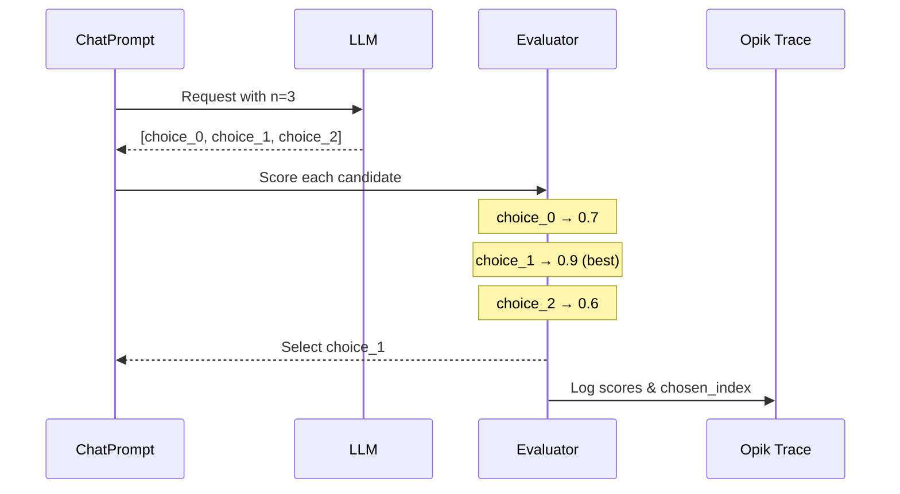

在优化提示词时，有两个独立的采样层可供控制：

- **数据集子采样**：选择评估哪些数据集行（`n_samples`、`n_samples_minibatch`、`n_samples_strategy`）。
- **模型采样**：为每行请求多个补全结果（`model_parameters` 中的 `n`）。

两者结合使用，可在成本、稳定性和探索之间取得平衡。

<Info>
  适用于 Opik Optimizer `v3.0.0+`。
</Info>

## 数据集子采样（n_samples）

`n_samples` 限制每次试验中评估的数据集行数。它适用于**评估数据集**（如果提供了 `validation_dataset` 则使用该数据集，否则使用 `dataset`）。

```python
result = optimizer.optimize_prompt(
    prompt=prompt,
    dataset=dataset,
    metric=metric,
    n_samples=50,
)
```
注意事项：
- `n_samples` 接受整数、浮点小数、百分比字符串（如 `"10%"`），或特殊值 `"all"`、`"full"`、`None`。
- 如果 `n_samples` 大于评估数据集的大小，优化器将回退到完整数据集并记录警告。

## 确定性子采样（n_samples_strategy）

`n_samples_strategy` 控制在设置 `n_samples` 时*如何*选择数据集行。默认策略为 `"random_sorted"`，其工作方式如下：

1. 对数据集项 ID 进行排序。
2. 使用优化器种子和评估阶段进行确定性洗牌。
3. 取前 `n_samples` 个 ID。

如果数据集项不包含 ID，优化器将回退到数据集顺序。

```python
result = optimizer.optimize_prompt(
    prompt=prompt,
    dataset=dataset,
    metric=metric,
    n_samples=50,
    n_samples_strategy="random_sorted",
)
```

<Info>
  目前仅支持 `"random_sorted"`。传入其他策略将引发 `ValueError`。
</Info>

## 小批量采样（n_samples_minibatch）

某些优化器运行*内循环*评估（例如 HRPO 和 GEPA）。使用 `n_samples_minibatch` 可以限制这些内部评估的规模，而不减少外部评估的大小。

```python
result = optimizer.optimize_prompt(
    prompt=prompt,
    dataset=dataset,
    metric=metric,
    n_samples=200,
    n_samples_minibatch=25,
)
```

如果未设置 `n_samples_minibatch`，则默认为 `n_samples`。

## 显式项目选择（dataset_item_ids）

对于完全确定性的评估，可以向 `evaluate_prompt` 传入显式的数据集项 ID 列表。这会绕过采样策略，并且与 `n_samples` **互斥**。

```python
score = optimizer.evaluate_prompt(
    prompt=prompt,
    dataset=dataset,
    metric=metric,
    dataset_item_ids=["item-1", "item-2", "item-3"],
)
```

<Info>
  启用调试日志时，评估日志会包含采样模式和解析后的数据集大小。
</Info>

## 每个示例的多补全（n 参数）

单样本评估可能存在噪声。`n` 参数允许为每个示例生成**多个候选输出**并选择最佳结果，从而引入多样性并降低评估方差。

### 工作原理

在提示词的 `model_parameters` 中设置 `n > 1` 时，优化器会：

1. 通过单次 API 调用从 LLM 请求 N 个补全结果（pass@N）
2. 使用评估指标对每个候选输出进行评分
3. 选择最佳候选结果（`best_by_metric` 策略）
4. 将所有评分和选择信息记录到 Opik 追踪中

在每轮已生成多个提示词变体的优化器中，`n` 会应用于每次评估，因此总候选评估量按 `prompts_per_round * n` 缩放。

对于执行生成代码的任务（如 ARC-AGI 或工具驱动的智能体），这意味着每个提示词会产生多个候选程序，这些程序会被执行和评分，最佳候选结果将用于优化反馈。



### 配置

在 `ChatPrompt.model_parameters` 中设置 `n` 参数：

```python
from opik_optimizer import ChatPrompt

# Generate 3 candidates per evaluation, select best
prompt = ChatPrompt(
    model="gpt-4o-mini",
    messages=[
        {"role": "system", "content": "You are a helpful assistant."},
        {"role": "user", "content": "Answer: {question}"},
    ],
    model_parameters={
        "n": 3,  # Generate 3 completions per call
        "temperature": 0.7,  # Higher temp = more variety between candidates
    },
)
```

<Info>
  较高的 `temperature` 值会增加 N 个候选结果之间的多样性。建议在 `n > 1` 时使用 `temperature: 0.7-1.0` 以最大化多样性。
</Info>

<Info>
  底层的 `call_model` 和 `call_model_async` 辅助函数默认返回单个响应，除非传入 `return_all=True`。优化器内部会处理 `n`，因此只有在直接调用这些辅助函数时才需要 `return_all`。
</Info>

### 使用场景

<AccordionGroup>
  <Accordion title="降低评估方差">
    单样本评估存在噪声。使用 `n=3` 时，优化器会对每个候选结果评分并使用最佳结果，这使得优化对随机失败更加稳健。

    ```python
    # Before: Single sample - noisy evaluation
    prompt = ChatPrompt(model="gpt-4o-mini", messages=[...])
    # Score might be 0.6 or 0.9 depending on luck

    # After: Best-of-3 - more stable evaluation
    prompt = ChatPrompt(
        model="gpt-4o-mini",
        messages=[...],
        model_parameters={"n": 3, "temperature": 0.8},
    )
    # Score reflects best achievable output
    ```
  </Accordion>

  <Accordion title="Pass@k 风格优化">
    受代码生成基准测试（pass@k）启发，这种方法衡量的是提示词*能否*产生正确输出，而不仅仅是*通常*能否产生正确输出。

    ```python
    # Optimize for "can this prompt ever get it right?"
    prompt = ChatPrompt(
        model="gpt-4o-mini",
        messages=[...],
        model_parameters={"n": 5},  # pass@5 style
    )
    ```

    适用场景：
    - 正确性比一致性更重要
    - 推理时使用多数投票或 best-of-k
    - 任务具有高方差（创意写作、复杂推理）
  </Accordion>

  <Accordion title="处理随机性任务">
    某些任务天然具有多个有效答案。使用 `n > 1` 可以帮助优化器找到能够生成*任意*有效答案的提示词。

    ```python
    # Creative task: multiple valid outputs
    prompt = ChatPrompt(
        model="gpt-4o-mini",
        messages=[
            {"role": "user", "content": "Write a haiku about {topic}"},
        ],
        model_parameters={"n": 3, "temperature": 1.0},
    )
    ```
  </Accordion>
</AccordionGroup>

## 选择策略

目前，优化器支持以下选择策略：

- `best_by_metric`（默认）：使用评估指标对每个候选结果评分，选择最佳结果。
- `first`：选择第一个候选结果（快速、确定性，但忽略评分）。
- `concat`：将所有候选结果连接为一个输出字符串。
- `random`：随机选择一个候选结果（如提供种子则为确定性随机）。
- `max_logprob`：选择平均 token 对数概率最高的候选结果（需要提供商支持；必须在模型 kwargs 中启用 logprobs）。

使用 `model_parameters` 中的 `selection_policy` 键进行覆盖。优化器通过共享的候选选择工具路由这些策略，以确保各优化器之间行为一致：

```python
prompt = ChatPrompt(
    model="gpt-4o-mini",
    messages=[...],
    model_parameters={
        "n": 3,
        "selection_policy": "first",
    },
)
```

对于 `max_logprob`，需要在模型 kwargs 中启用 logprobs（提供商支持情况不同）：

```python
prompt = ChatPrompt(
    model="gpt-4o-mini",
    messages=[...],
    model_parameters={
        "n": 3,
        "selection_policy": "max_logprob",
        "logprobs": True,
        "top_logprobs": 1,
    },
)
```

当 `selection_policy=best_by_metric` 时，优化器会：

1. 使用评估指标函数独立评分每个候选结果
2. 选择得分最高的候选结果作为最终输出
3. 将所有评分和选择的索引记录到追踪元数据中

```python
# What happens internally:
candidates = ["output_1", "output_2", "output_3"]
scores = [metric(item, c) for c in candidates]  # [0.7, 0.9, 0.6]
best_idx = argmax(scores)  # 1
final_output = candidates[best_idx]  # "output_2"
```

追踪元数据包括：
- `n_requested`：请求的补全数量
- `candidates_scored`：已评估的候选数量
- `candidate_scores`：所有评分列表（仅 best_by_metric）
- `candidate_logprobs`：对数概率评分列表（仅 max_logprob）
- `chosen_index`：所选候选结果的索引

## 成本考量

<Warning>
  使用 `n > 1` 会按比例增加 API 成本。当 `n=3` 时，每次评估调用的补全 token 成本约为 3 倍。
</Warning>

| n 值 | 相对成本 | 方差缩减 |
|---------|---------------|-------------------|
| 1 | 1x | 基准 |
| 3 | ~3x | 显著 |
