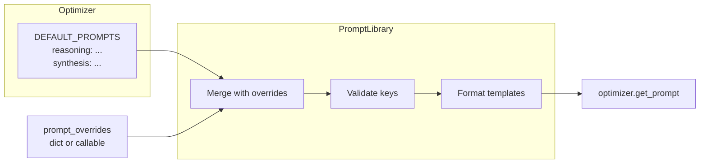

Opik 优化器使用 **PromptLibrary** 系统，允许您自定义每个优化器使用的内部提示词。当您需要以下场景时，此功能非常有用：

- 添加特定领域的约束（法律、医疗、编码标准）
- 注入安全或合规要求
- 调整输出格式或样式
- 尝试不同的推理方法

## 快速开始

每个优化器都接受一个 `prompt_overrides` 参数：

```python
from opik_optimizer import MetaPromptOptimizer

# Simple dict override
optimizer = MetaPromptOptimizer(
    model="gpt-4o",
    prompt_overrides={"reasoning_system": "Be concise. Focus on clarity."}
)
```

## 工作原理

每个优化器都定义了自己的 `DEFAULT_PROMPTS` 字典，其中包含特定于该算法的键。PromptLibrary：

1. 存储默认提示词
2. 应用您的覆盖（字典或可调用对象）
3. 验证覆盖键是否存在（尽早捕获拼写错误）
4. 提供 `get_prompt()` 用于运行时访问



## 覆盖方法

<AccordionGroup>
  <Accordion title="字典覆盖（简单替换）">
    当您确切知道要用静态字符串替换哪个提示词时，此方法最佳：

    ```python
    from opik_optimizer import EvolutionaryOptimizer

    optimizer = EvolutionaryOptimizer(
        model="gpt-4o",
        prompt_overrides={
            "synonyms_system_prompt": "Return exactly ONE synonym. No explanation.",
            "infer_style_system_prompt": "Analyze the writing style briefly.",
        }
    )
    ```
  </Accordion>

  <Accordion title="可调用覆盖（动态修改）">
    当您需要修改现有提示词、应用条件逻辑或更新多个提示词时，此方法最佳：

    ```python
    from opik_optimizer import MetaPromptOptimizer
    from opik_optimizer.utils.prompt_library import PromptLibrary

    def customize_prompts(prompts: PromptLibrary) -> None:
        # List available keys
        print("Available keys:", prompts.keys())

        # Prepend a constraint to the reasoning prompt
        original = prompts.get("reasoning_system")
        prompts.set("reasoning_system", "Always respond in English.\n\n" + original)

        # Append format instructions to another prompt
        if "candidate_generation" in prompts.keys():
            prompts.set(
                "candidate_generation",
                prompts.get("candidate_generation") + "\n\nUse markdown formatting."
            )

    optimizer = MetaPromptOptimizer(
        model="gpt-4o",
        prompt_overrides=customize_prompts
    )
    ```
  </Accordion>
</AccordionGroup>

## 发现可用的键

每个优化器有不同的提示词键。使用 `list_prompts()` 来发现它们：

```python
from opik_optimizer import MetaPromptOptimizer

optimizer = MetaPromptOptimizer(model="gpt-4o")
print("Available prompt keys:")
for key in optimizer.list_prompts():
    print(f"  - {key}")
```

### 各优化器的常用键

| 优化器 | 键示例 |
|-----------|--------------|
| **MetaPromptOptimizer** | `reasoning_system`, `candidate_generation`, `synthesis`, `pattern_extraction_system` |
| **EvolutionaryOptimizer** | `infer_style_system_prompt`, `synonyms_system_prompt`, `semantic_mutation_system_prompt_template` |
| **FewShotBayesianOptimizer** | `example_placeholder`, `system_prompt_template` |
| **HierarchicalReflectiveOptimizer** | `batch_analysis_prompt`, `synthesis_prompt`, `improve_prompt_template` |

## 在运行时读取提示词

创建优化器后，您可以检查当前的提示词：

```python
optimizer = MetaPromptOptimizer(
    model="gpt-4o",
    prompt_overrides={"reasoning_system": "Custom prompt here..."}
)

# Get the current (possibly overridden) prompt
current = optimizer.get_prompt("reasoning_system")
print(current)

# Get the original default (before any overrides)
default = optimizer.prompts.get_default("reasoning_system")
print(default)
```

## 模板变量

一些提示词包含占位符，这些占位符在运行时使用 Python 的 `{variable}` 格式填充。覆盖包含占位符的提示词时，**请保留相同的占位符**：

```python
# Original: "Generate {num_prompts} variations of the prompt."
# Your override should keep {num_prompts}:
prompt_overrides = {
    "candidate_generation": "Be creative. Generate {num_prompts} diverse variations."
}
```

## 使用场景

<AccordionGroup>
  <Accordion title="添加领域约束">
    ```python
    def add_legal_constraints(prompts: PromptLibrary) -> None:
        for key in prompts.keys():
            original = prompts.get(key)
            prompts.set(key,
                "LEGAL CONTEXT: Do not reference specific case law.\n\n" + original
            )

    optimizer = MetaPromptOptimizer(
        model="gpt-4o",
        prompt_overrides=add_legal_constraints
    )
    ```
  </Accordion>

  <Accordion title="强制输出格式">
    ```python
    optimizer = EvolutionaryOptimizer(
        model="gpt-4o",
        prompt_overrides={
            "infer_style_system_prompt": """
    Analyze writing style. Return a JSON object with:
    {
      "tone": "formal|casual|technical",
      "complexity": "simple|moderate|complex",
      "key_patterns": ["list", "of", "patterns"]
    }
    """
        }
    )
    ```
  </Accordion>

  <Accordion title="添加安全防护">
    ```python
    def add_safety_layer(prompts: PromptLibrary) -> None:
        safety_prefix = """
    SAFETY REQUIREMENTS:
    - Never generate harmful or offensive content
    - Avoid personal identifiable information
    - Flag uncertain responses

    """
        for key in prompts.keys():
            if "system" in key.lower():
                prompts.set(key, safety_prefix + prompts.get(key))

    optimizer = MetaPromptOptimizer(
        model="gpt-4o",
        prompt_overrides=add_safety_layer
    )
    ```
  </Accordion>
</AccordionGroup>

## 错误处理

PromptLibrary 会验证键以尽早捕获拼写错误：

```python
# This will raise KeyError - "reasoing_system" is misspelled
optimizer = MetaPromptOptimizer(
    model="gpt-4o",
    prompt_overrides={"reasoing_system": "Oops, typo!"}  # KeyError!
)

# Error message shows available keys:
# KeyError: "Unknown prompt keys: ['reasoing_system'].
#            Available: ['candidate_generation', 'reasoning_system', ...]"
```

## 最佳实践

<Info>
  **有效提示词自定义的技巧：**

  1. **先列出键** – 覆盖前始终使用 `list_prompts()` 查看可用的键
  2. **保留占位符** – 如果提示词包含 `{variables}`，请在覆盖中保留它们
  3. **逐步测试** – 每次覆盖一个提示词，以便隔离效果
  4. **对复杂逻辑使用可调用对象** – 字典更简单，但可调用对象更强大
  5. **不要破坏 JSON** – 一些提示词期望 JSON 输出；请保持该结构
</Info>

## 完整示例

```python
from opik_optimizer import MetaPromptOptimizer
from opik_optimizer.utils.prompt_library import PromptLibrary

def my_customizations(prompts: PromptLibrary) -> None:
    """Customize prompts for a code generation task."""

    # 1. Add coding focus to reasoning
    prompts.set(
        "reasoning_system",
        "You are an expert code prompt engineer.\n\n" + prompts.get("reasoning_system")
    )

    # 2. Enforce Python-specific patterns
    prompts.set(
        "candidate_generation",
        prompts.get("candidate_generation") + """

ADDITIONAL REQUIREMENTS:
- Prompts should encourage well-documented code
- Prefer type hints and docstrings
- Emphasize error handling and edge cases
"""
    )

# Create optimizer with customizations
optimizer = MetaPromptOptimizer(
    model="gpt-4o",
    prompt_overrides=my_customizations
)

# Verify customizations applied
print("Customized reasoning prompt:")
print(optimizer.get_prompt("reasoning_system")[:200] + "...")
```

## 相关内容

- [API 参考](/development/optimization-runs/advanced/api_reference) – 完整的参数文档
- [自定义指标](/development/optimization-runs/advanced/custom_metrics) – 构建专用评估指标
- [扩展优化器](/development/optimization-runs/advanced/extending_optimizers) – 创建自定义优化器子类
