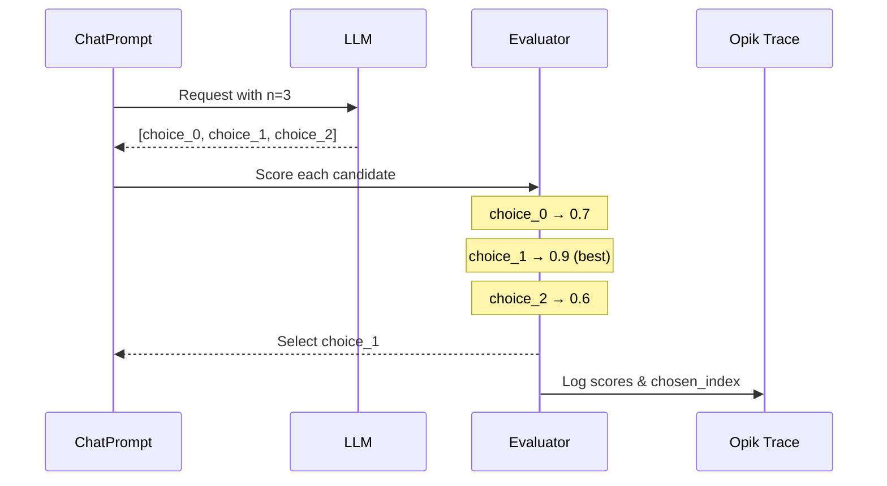

优化提示词时，单样本评估可能有噪声——一个好的提示词可能由于 LLM 随机性在特定试验中失败。`n` 参数让您在每次评估中生成**多个候选输出**并选择最佳的一个，引入多样性并减少评估方差。

<Info>
  在 Opik Optimizer `v3.0.0+` 中可用。
</Info>

## 工作原理

当您在提示词的 `model_parameters` 中设置 `n > 1` 时，优化器每次评估请求 N 个补全，对每个候选评分，选择最佳的一个，并将所有分数记录到跟踪中。关于 `n` 参数如何工作的完整解释维护在[采样控制](/v1/agent_optimization/advanced/n_samples#multiple-completions-per-example-n-parameter)中。



## 配置

在 `ChatPrompt.model_parameters` 中设置 `n` 参数：

```python
from opik_optimizer import ChatPrompt

# Generate 3 candidates per evaluation, select best
prompt = ChatPrompt(
    model="gpt-4o-mini",
    messages=[
        {"role": "system", "content": "You are a helpful assistant."},
        {"role": "user", "content": "Answer: {question}"},
    ],
    model_parameters={
        "n": 3,  # Generate 3 completions per call
        "temperature": 0.7,  # Higher temp = more variety between candidates
    },
)
```

<Info>
  更高的 `temperature` 值会增加 N 个候选之间的多样性。考虑使用 `temperature: 0.7-1.0` 配合 `n > 1` 以最大化多样性。
</Info>

<Info>
  底层的 `call_model` 和 `call_model_async` 辅助函数返回单个响应，除非您传递 `return_all=True`。优化器在内部处理 `n`，因此您只需在直接调用这些辅助函数时使用 `return_all`。
</Info>

## 用例

<AccordionGroup>
  <Accordion title="减少评估方差">
    单样本评估有噪声。使用 `n=3`，优化器对每个候选评分并使用最佳结果，这使优化对随机故障更加稳健。

    ```python
    # Before: Single sample - noisy evaluation
    prompt = ChatPrompt(model="gpt-4o-mini", messages=[...])
    # Score might be 0.6 or 0.9 depending on luck

    # After: Best-of-3 - more stable evaluation
    prompt = ChatPrompt(
        model="gpt-4o-mini",
        messages=[...],
        model_parameters={"n": 3, "temperature": 0.8},
    )
    # Score reflects best achievable output
    ```
  </Accordion>

  <Accordion title="Pass@k 风格优化">
    受代码生成基准（pass@k）启发，这种方法衡量提示词*能否*产生正确输出，而不仅仅是它*通常*是否能。

    ```python
    # Optimize for "can this prompt ever get it right?"
    prompt = ChatPrompt(
        model="gpt-4o-mini",
        messages=[...],
        model_parameters={"n": 5},  # pass@5 style
    )
    ```

    这在以下情况有用：
    - 正确性比一致性更重要
    - 您将在推理时使用多数投票或 best-of-k
    - 任务具有高方差（创意写作、复杂推理）
  </Accordion>

  <Accordion title="处理随机任务">
    某些任务自然有多个有效答案。使用 `n > 1` 帮助优化器找到可以生成*任何*有效答案的提示词。

    ```python
    # Creative task: multiple valid outputs
    prompt = ChatPrompt(
        model="gpt-4o-mini",
        messages=[
            {"role": "user", "content": "Write a haiku about {topic}"},
        ],
        model_parameters={"n": 3, "temperature": 1.0},
    )
    ```
  </Accordion>
</AccordionGroup>

## 选择策略

目前，优化器支持这些选择策略：

- `best_by_metric`（默认）：使用指标对每个候选评分并选择最佳的。
- `first`：选择第一个候选（快速、确定性，但忽略评分）。
- `concat`：将所有候选连接成一个输出字符串。
- `random`：选择随机候选（如果提供则使用种子）。
- `max_logprob`：选择具有最高平均 token logprob 的候选（需要提供商支持；必须在模型 kwargs 中启用 logprobs）。

使用 `model_parameters` 中的 `selection_policy` 键进行覆盖。优化器通过共享的候选选择实用程序路由这些策略，因此行为在所有优化器中保持一致：

```python
prompt = ChatPrompt(
    model="gpt-4o-mini",
    messages=[...],
    model_parameters={
        "n": 3,
        "selection_policy": "first",
    },
)
```

对于 `max_logprob`，在模型 kwargs 中启用 logprobs（提供商支持各不相同）：

```python
prompt = ChatPrompt(
    model="gpt-4o-mini",
    messages=[...],
    model_parameters={
        "n": 3,
        "selection_policy": "max_logprob",
        "logprobs": True,
        "top_logprobs": 1,
    },
)
```

当 `selection_policy=best_by_metric` 时，优化器：

1. 每个候选使用您的指标函数独立评分
2. 选择得分最高的候选作为最终输出
3. 所有分数和选择的索引记录到跟踪元数据中

```python
# What happens internally:
candidates = ["output_1", "output_2", "output_3"]
scores = [metric(item, c) for c in candidates]  # [0.7, 0.9, 0.6]
best_idx = argmax(scores)  # 1
final_output = candidates[best_idx]  # "output_2"
```

跟踪元数据包括：
- `n_requested`：请求的补全数
- `candidates_scored`：评估的候选数
- `candidate_scores`：所有分数列表（仅 best_by_metric）
- `candidate_logprobs`：logprob 分数列表（仅 max_logprob）
- `chosen_index`：选择的候选索引

## 成本考虑

<Warning>
  使用 `n > 1` 会按比例增加 API 成本。使用 `n=3`，您每次评估调用大约支付 3 倍的补全 token。
</Warning>

| n 值 | 相对成本 | 方差减少 |
|---------|---------------|-------------------|
| 1 | 1x | 基线 |
| 3 | ~3x | 显著 |
| 5 | ~5x | 高 |
| 10 | ~10x | 非常高 |

**建议：**
- 大多数用例从 `n=3` 开始
- 仅对高方差任务使用 `n=5-10`
- 选择 N 时考虑总优化预算

## 限制

<AccordionGroup>
  <Accordion title="工具调用强制 n=1">
    当 `allow_tool_use=True` 且定义了工具时，优化器强制 `n=1`。这是因为工具调用需要维护连贯的消息线程，这与多个独立补全不兼容。

    ```python
    # Tool-calling prompt - n will be forced to 1
    prompt = ChatPrompt(
        model="gpt-4o-mini",
        messages=[...],
        tools=[...],
        model_parameters={"n": 3},  # Ignored when tools are used
    )
    ```
  </Accordion>

  <Accordion title="某些优化器忽略 n">
    期望单个结构化响应的提示词合成步骤（如 few-shot 和 parameter 优化器）忽略 `n`，以避免返回多个冲突的模板。
  </Accordion>

  <Accordion title="并非所有提供商都支持 n">
    某些 LLM 提供商不支持 `n` 参数。请检查您提供商的文档。LiteLLM 会自动删除不支持的参数。
  </Accordion>
</AccordionGroup>

## 完整示例

```python
from opik_optimizer import ChatPrompt, MetaPromptOptimizer
from opik.evaluation.metrics import LevenshteinRatio

# Create prompt with n=3 for variety
prompt = ChatPrompt(
    model="gpt-4o-mini",
    messages=[
        {"role": "system", "content": "Extract the key entities from the text."},
        {"role": "user", "content": "{text}"},
    ],
    model_parameters={
        "n": 3,  # Generate 3 candidates
        "temperature": 0.7,  # Moderate variety
    },
)

# Define metric
def extraction_accuracy(dataset_item, llm_output):
    expected = dataset_item["expected_entities"]
    return LevenshteinRatio().score(expected, llm_output)

# Optimize - each trial evaluates 3 candidates, picks best
optimizer = MetaPromptOptimizer(model="gpt-4o")
result = optimizer.optimize_prompt(
    prompt=prompt,
    dataset=my_dataset,
    metric=extraction_accuracy,
)

print(f"Best prompt score: {result.score}")
```

## 相关内容

- [优化提示词](/v1/agent_optimization/optimization/optimize_prompts) - 核心优化指南
- [定义指标](/v1/agent_optimization/optimization/define_metrics) - 创建自定义指标
- [自定义指标](/v1/agent_optimization/advanced/custom_metrics) - 高级指标模式
- [API 参考](/v1/agent_optimization/advanced/api_reference) - 完整参数文档
