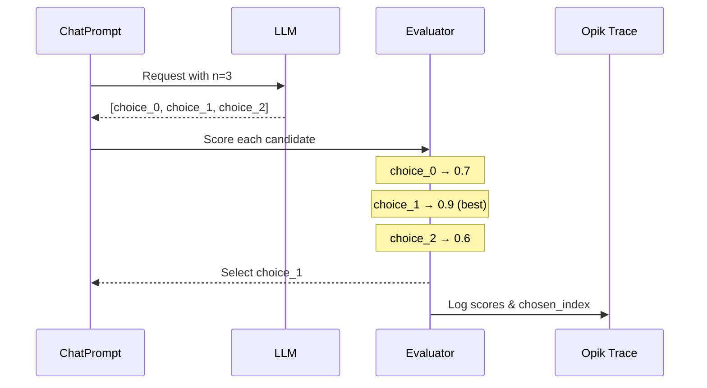

优化提示词时，有两个独立的采样层可以控制：

- **数据集子采样**：选择评估哪些数据集行（`n_samples`、`n_samples_minibatch`、`n_samples_strategy`）。
- **模型采样**：每行请求多个补全（`model_parameters` 中的 `n`）。

使用两者来平衡成本、稳定性和探索。

<Info>
  在 Opik Optimizer `v3.0.0+` 中可用。
</Info>

## 数据集子采样（n_samples）

`n_samples` 限制每次试验评估多少数据集行。它适用于**评估数据集**（如果提供了 `validation_dataset` 则为 `validation_dataset`，否则为 `dataset`）。

```python
result = optimizer.optimize_prompt(
    prompt=prompt,
    dataset=dataset,
    metric=metric,
    n_samples=50,
)
```
注意：
- `n_samples` 接受整数、分数浮点数、百分比字符串（例如 `"10%"`），或特殊值 `"all"`、`"full"` 或 `None`。
- 如果 `n_samples` 大于评估数据集大小，优化器回退到完整数据集并记录警告。

## 确定性子采样（n_samples_strategy）

`n_samples_strategy` 控制当设置 `n_samples` 时*如何*选择数据集行。默认策略是 `"random_sorted"`，它：

1. 对数据集项 ID 排序。
2. 使用优化器种子和评估阶段确定性地打乱它们。
3. 取前 `n_samples` 个 ID。

如果您的数据集项不包含 ID，优化器回退到数据集顺序。

```python
result = optimizer.optimize_prompt(
    prompt=prompt,
    dataset=dataset,
    metric=metric,
    n_samples=50,
    n_samples_strategy="random_sorted",
)
```

<Info>
  目前仅支持 `"random_sorted"`。传递其他策略将引发 `ValueError`。
</Info>

## 小批量采样（n_samples_minibatch）

某些优化器运行*内部循环*评估（例如，HRPO 和 GEPA）。使用 `n_samples_minibatch` 来限制这些内部评估，而不减少外部评估大小。

```python
result = optimizer.optimize_prompt(
    prompt=prompt,
    dataset=dataset,
    metric=metric,
    n_samples=200,
    n_samples_minibatch=25,
)
```

如果未设置 `n_samples_minibatch`，则默认为 `n_samples`。

## 显式项选择（dataset_item_ids）

对于完全确定性的评估，您可以将显式的数据集项 ID 列表传递给 `evaluate_prompt`。这绕过采样策略，并且与 `n_samples` **互斥**。

```python
score = optimizer.evaluate_prompt(
    prompt=prompt,
    dataset=dataset,
    metric=metric,
    dataset_item_ids=["item-1", "item-2", "item-3"],
)
```

<Info>
  启用调试日志时，评估日志包括采样模式和解析的数据集大小。
</Info>

## 每个示例的多次补全（n 参数）

单样本评估可能有噪声。`n` 参数让您为每个示例生成**多个候选输出**并选择最佳的一个，引入多样性并减少评估方差。

### 工作原理

当您在提示词的 `model_parameters` 中设置 `n > 1` 时，优化器：

1. 在单个 API 调用中从 LLM 请求 N 个补全（pass@N）
2. 使用您的指标对每个候选输出评分
3. 选择最佳候选（`best_by_metric` 策略）
4. 将所有分数和选择信息记录到 Opik 跟踪中

在已经每轮生成多个提示词变体的优化器中，`n` 应用于每次评估，因此总候选评估按 `prompts_per_round * n` 缩放。

对于执行生成代码的任务（如 ARC-AGI 或工具驱动的代理），这意味着每个提示词产生多个被执行和评分的候选程序，最佳候选用于优化反馈。



### 配置

在 `ChatPrompt.model_parameters` 中设置 `n` 参数：

```python
from opik_optimizer import ChatPrompt

# Generate 3 candidates per evaluation, select best
prompt = ChatPrompt(
    model="gpt-4o-mini",
    messages=[
        {"role": "system", "content": "You are a helpful assistant."},
        {"role": "user", "content": "Answer: {question}"},
    ],
    model_parameters={
        "n": 3,  # Generate 3 completions per call
        "temperature": 0.7,  # Higher temp = more variety between candidates
    },
)
```

<Info>
  更高的 `temperature` 值会增加 N 个候选之间的多样性。考虑使用 `temperature: 0.7-1.0` 配合 `n > 1` 以最大化多样性。
</Info>

<Info>
  底层的 `call_model` 和 `call_model_async` 辅助函数返回单个响应，除非您传递 `return_all=True`。优化器在内部处理 `n`，因此您只需在直接调用这些辅助函数时使用 `return_all`。
</Info>

### 用例

<AccordionGroup>
  <Accordion title="减少评估方差">
    单样本评估有噪声。使用 `n=3`，优化器对每个候选评分并使用最佳结果，这使优化对随机故障更加稳健。

    ```python
    # Before: Single sample - noisy evaluation
    prompt = ChatPrompt(model="gpt-4o-mini", messages=[...])
    # Score might be 0.6 or 0.9 depending on luck

    # After: Best-of-3 - more stable evaluation
    prompt = ChatPrompt(
        model="gpt-4o-mini",
        messages=[...],
        model_parameters={"n": 3, "temperature": 0.8},
    )
    # Score reflects best achievable output
    ```
  </Accordion>

  <Accordion title="Pass@k 风格优化">
    受代码生成基准（pass@k）启发，这种方法衡量提示词*能否*产生正确输出，而不仅仅是它*通常*是否能。

    ```python
    # Optimize for "can this prompt ever get it right?"
    prompt = ChatPrompt(
        model="gpt-4o-mini",
        messages=[...],
        model_parameters={"n": 5},  # pass@5 style
    )
    ```

    这在以下情况有用：
    - 正确性比一致性更重要
    - 您将在推理时使用多数投票或 best-of-k
    - 任务具有高方差（创意写作、复杂推理）
  </Accordion>

  <Accordion title="处理随机任务">
    某些任务自然有多个有效答案。使用 `n > 1` 帮助优化器找到可以生成*任何*有效答案的提示词。

    ```python
    # Creative task: multiple valid outputs
    prompt = ChatPrompt(
        model="gpt-4o-mini",
        messages=[
            {"role": "user", "content": "Write a haiku about {topic}"},
        ],
        model_parameters={"n": 3, "temperature": 1.0},
    )
    ```
  </Accordion>
</AccordionGroup>

## 选择策略

目前，优化器支持这些选择策略：

- `best_by_metric`（默认）：使用指标对每个候选评分并选择最佳的。
- `first`：选择第一个候选（快速、确定性，但忽略评分）。
- `concat`：将所有候选连接成一个输出字符串。
- `random`：选择随机候选（如果提供则使用种子）。
- `max_logprob`：选择具有最高平均 token logprob 的候选（需要提供商支持；必须在模型 kwargs 中启用 logprobs）。

使用 `model_parameters` 中的 `selection_policy` 键进行覆盖。优化器通过共享的候选选择实用程序路由这些策略，因此行为在所有优化器中保持一致：

```python
prompt = ChatPrompt(
    model="gpt-4o-mini",
    messages=[...],
    model_parameters={
        "n": 3,
        "selection_policy": "first",
    },
)
```

对于 `max_logprob`，在模型 kwargs 中启用 logprobs（提供商支持各不相同）：

```python
prompt = ChatPrompt(
    model="gpt-4o-mini",
    messages=[...],
    model_parameters={
        "n": 3,
        "selection_policy": "max_logprob",
        "logprobs": True,
        "top_logprobs": 1,
    },
)
```

当 `selection_policy=best_by_metric` 时，优化器：

1. 每个候选使用您的指标函数独立评分
2. 选择得分最高的候选作为最终输出
3. 所有分数和选择的索引记录到跟踪元数据中

```python
# What happens internally:
candidates = ["output_1", "output_2", "output_3"]
scores = [metric(item, c) for c in candidates]  # [0.7, 0.9, 0.6]
best_idx = argmax(scores)  # 1
final_output = candidates[best_idx]  # "output_2"
```

跟踪元数据包括：
- `n_requested`：请求的补全数
- `candidates_scored`：评估的候选数
- `candidate_scores`：所有分数列表（仅 best_by_metric）
- `candidate_logprobs`：logprob 分数列表（仅 max_logprob）
- `chosen_index`：选择的候选索引

## 成本考虑

<Warning>
  使用 `n > 1` 会按比例增加 API 成本。使用 `n=3`，您每次评估调用大约支付 3 倍的补全 token。
</Warning>

| n 值 | 相对成本 | 方差减少 |
|---------|---------------|-------------------|
| 1 | 1x | 基线 |
| 3 | ~3x | 显著 |
