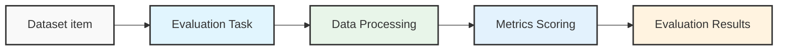

TypeScript SDK 提供了一种简洁的方式来评估您的 LLM 应用程序，通过 `evaluate` 函数处理各种评估场景。

## 文档结构

TypeScript SDK 评估文档涵盖以下内容：

- **[快速开始](/reference/typescript-sdk/evaluation/quick-start)**：快速上手基础评估
- **[数据集](/reference/typescript-sdk/evaluation/datasets)**：使用评估数据集
- **[Evaluate 函数](/reference/typescript-sdk/evaluation/evaluate_function)**：使用 evaluate 函数
- **[评估指标](/reference/typescript-sdk/evaluation/metrics)**：可用指标及自定义指标创建
- **[实验](/reference/typescript-sdk/evaluation/experiments)**：创建和管理评估实验
